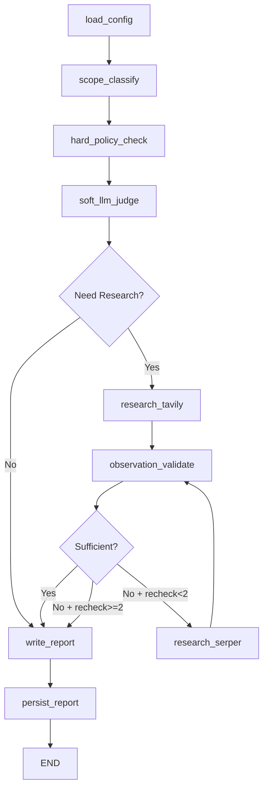

# 🎉 PushGuardian 터파기 작업 완료 요약

## ✅ 완료된 작업 목록

### 📦 1. 프로젝트 기본 구조
- [x] Git 저장소 초기화
- [x] .gitignore, .env.example 생성
- [x] requirements.txt, setup.py 작성
- [x] 디렉토리 구조 생성 (detectors, llm, research, report)

### 🔧 2. 핵심 모듈 구현
- [x] **config.py**: YAML 설정 로더 + API 키 자동 로드
- [x] **git_ops.py**: Git diff 추출, 파일 파싱, history scan
- [x] **detectors/**: secrets, files, stack_guess 탐지기
- [x] **llm/**: judge (soft check), observe (evidence 검증)
- [x] **research/**: Tavily, Serper 클라이언트 + gather
- [x] **report/**: Finding/Evidence 모델 + MD 생성기

### 🌐 3. LangGraph 워크플로우
- [x] **graph.py**: 전체 워크플로우 정의
  - 노드: load_config → scope_classify → hard_policy_check → soft_llm_judge → research → observe → report → persist
  - 조건부 라우팅: should_do_research, should_recheck
  - State 관리: GuardianState TypedDict

### 🖥️ 4. CLI & Git Hook
- [x] **cli.py**: Pre-push hook CLI 진입점
  - Rich 라이브러리 터미널 UI
  - Human-in-loop 승인 프롬프트
  - Override 사유 기록
- [x] **install_hook.py**: Git hook 자동 설치
  - sys.executable 경로 박아서 conda env 문제 해결

### 🌍 5. Web Demo
- [x] **web.py**: FastAPI 백엔드
  - POST /analyze-diff: diff 분석 API
  - GET /download/{report_id}: MD 리포트 다운로드
  - HTML 폼 UI 내장
- [x] **streamlit_app.py**: Streamlit 프론트엔드
  - 인터랙티브 diff 업로드/분석
  - 실시간 결과 표시
  - MD 다운로드 버튼

### 🧪 6. 테스트 & 예제
- [x] **tests/**: 단위 테스트 기본 틀
  - test_detectors.py
  - test_git_ops.py
- [x] **examples/sample_diff.txt**: 테스트용 샘플

### 📚 7. 문서
- [x] **README.md**: 프로젝트 소개 + 사용법
- [x] **INSTALL.md**: 상세 설치 가이드
- [x] **NEXT_STEPS.md**: 다음 작업 가이드
- [x] **PROJECT_STRUCTURE.txt**: 프로젝트 구조 설명

### 🚀 8. 배포 준비
- [x] **Procfile**: Railway 배포용
- [x] **runtime.txt**: Python 버전 명시
- [x] **.streamlit/config.toml**: Streamlit 설정
- [x] **quickstart.bat/sh**: 빠른 설치 스크립트

---

## 📊 프로젝트 통계

- **총 Python 파일**: 23개
- **총 코드 라인**: ~2000+ 줄
- **모듈 수**: 4개 (detectors, llm, research, report)
- **노드 수**: 9개 (LangGraph)
- **테스트 파일**: 2개

---

## 🎯 핵심 기능 요약

### 1️⃣ Hard Abort (즉시 차단)
```yaml
# config.yaml에서 설정
hard_abort:
  secret_patterns: [sk-, AKIA, BEGIN PRIVATE KEY]
  file_patterns: [.env, *.pem, id_rsa]
```

### 2️⃣ Soft Check (LLM 분석)
- DTO/Schema 규약 위반
- 의존성 급변 위험
- 권한 관련 변경

### 3️⃣ Research Loop (최대 2회)
```
Tavily (1차) → Observation → [부족하면] → Serper (2차) → Observation
```

### 4️⃣ 학습 링크 제공
- 약한 스택 감지 시 자동 학습 링크 수집
- Principle (원리) + Example (예시) 링크

### 5️⃣ Human-in-Loop
```bash
⛔ Push is BLOCKED due to critical issues.
Do you want to override and push anyway? [y/N]: _
```

---

## 🔄 LangGraph 플로우 요약



---

## 🤔 작업 전 확인사항 (다시 정리)

### 필수 확인
1. **Conda 환경**: `conda create -n p_guard python=3.10`
2. **API 키 준비**:
   - OpenAI (필수): `C:\workplace\document\API\openai.txt`
   - Tavily (필수): `C:\workplace\document\API\tavily.txt`
   - Serper (선택): `C:\workplace\document\API\serper.txt`
3. **설치**: `pip install -e .`

### 선택 사항
- **배포**: Streamlit Cloud (추천) 또는 Railway
- **테스트 레포**: 실험용 git repo 준비
- **스택 프로필**: config.yaml의 stacks_known/weak 수정

---

## 🚧 다음 단계 추천 순서

### Phase 1: 로컬 테스트 (필수)
1. ✅ Conda 환경 생성 & 패키지 설치
2. ✅ API 키 확인/생성
3. ✅ 단위 테스트 실행: `pytest tests/ -v`
4. ✅ Streamlit 데모 실행: `streamlit run streamlit_app.py`
5. ✅ Sample diff 테스트

### Phase 2: Git Hook 테스트 (로컬)
1. 테스트용 git repo 준비
2. Hook 설치: `python -m pushguardian.install_hook`
3. Secret 포함 commit 테스트 (차단 확인)
4. 정상 commit 테스트 (allow 확인)

### Phase 3: 배포 (과제 제출용)
1. GitHub에 push
2. Streamlit Cloud 배포
3. 배포 URL README에 추가
4. 스크린샷/동작 예시 캡처

### Phase 4: 개선 (선택)
1. LLM 프롬프트 튜닝
2. Research 쿼리 최적화
3. 추가 테스트 케이스
4. MCP 연동 (Cursor/Claude Code)

---

## 💡 팁 & 노트

### Conda 활성화 (Windows)
```bash
# Anaconda Prompt 또는
conda activate p_guard
```

### API 키 자동 로드
`pushguardian/config.py`가 import 시 자동으로 `C:\workplace\document\API\` 에서 로드

### Hook 우회 (필요 시)
```bash
git push --no-verify
```

### LangSmith 트레이싱 (디버깅용)
```bash
# .env에 추가
LANGSMITH_API_KEY=your_key
LANGCHAIN_TRACING_V2=true
```

---

## 📞 다음 질문/확인

1. **API 키 상태**: 이미 있나요? 새로 발급해야 하나요?
2. **우선순위**: Hook 먼저? Web 먼저? 동시?
3. **배포 계획**: Streamlit Cloud만? Railway도?
4. **테스트 레포**: 실험용 repo 있나요?
5. **추가 기능**: History scan, MCP 연동 필요한가요?

---

**작업 완료! 다음 단계를 알려주시면 진행하겠습니다.** 🚀
